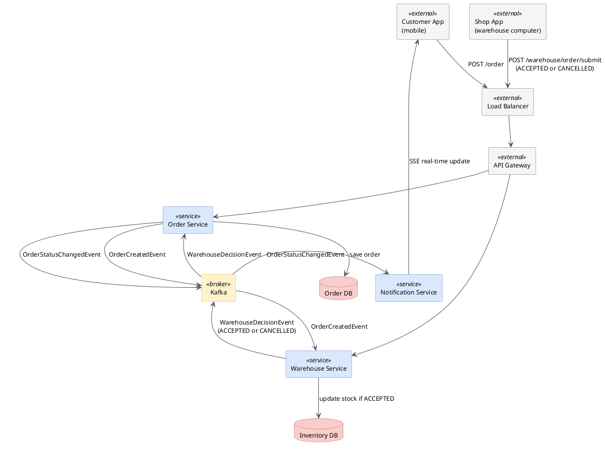

# Order State Machine — System Design

## Overview

A Spring Boot system for real-time order tracking with three core services:
- **Order Service** — manages order lifecycle and state machine
- **Warehouse Service** — processes stock decisions and updates inventory
- **Notification Service** — pushes real-time status updates to customers via SSE

## Architecture



## Flow

### Customer places an order
1. Customer App sends `POST /order` → Load Balancer → API Gateway → Order Service
2. Order Service saves order with status `CREATED` → Order DB
3. Order Service publishes `OrderCreatedEvent` to Kafka

### Admin processes the order
4. Warehouse Service consumes `OrderCreatedEvent` from Kafka
5. Admin checks stock availability in the Inventory DB
6. Shop App sends decision `POST /warehouse/order/submit` with `ACCEPTED` or `CANCELLED`
7. Warehouse Service:
    - If `ACCEPTED` → reserves stock in Inventory DB
    - If `CANCELLED` → no stock update needed
8. Warehouse Service publishes `WarehouseDecisionEvent` to Kafka

### Order status updated
9. Order Service consumes `WarehouseDecisionEvent`
10. Order Service updates status → `ACCEPTED` or `CANCELLED`
11. Order Service publishes `OrderStatusChangedEvent` to Kafka

### Customer receives real-time update
12. Notification Service consumes `OrderStatusChangedEvent`
13. Notification Service pushes update to Customer App via SSE
14. Customer sees: "Your order has been ACCEPTED" or "Your order has been CANCELLED — item not in stock"

## Order State Machine

```
CREATED → ACCEPTED → IN_PROCESS → DELIVERED
    ↓          ↓           ↓
CANCELLED  CANCELLED   CANCELLED
```

Transitions validated by `OrderStatus.canTransitionTo()` — illegal transitions are rejected.

## Services

### Order Service
- `OrderService` — creates orders and manages status transitions
- `OrderEventPublisher` — publishes events to Kafka
- `OrderStatusUpdateListener` — consumes warehouse decisions from Kafka
- `OrderController` — REST endpoint for customer to place orders

### Warehouse Service
- `WarehouseService` — receives shop decision, updates inventory if accepted
- `WarehouseOrderListener` — consumes OrderCreatedEvent from Kafka
- `WarehouseDecisionPublisher` — publishes decisions to Kafka
- `WarehouseController` — REST endpoint for Shop App to submit decisions

### Notification Service
- `OrderStatusNotifier` — manages SSE connections, pushes updates to customers
- `OrderEventConsumer` — consumes OrderStatusChangedEvent from Kafka
- `NotificationController` — SSE endpoint for Customer App to subscribe

## Kafka Events

| Event | Producer | Consumer | Description |
|---|---|---|---|
| `OrderCreatedEvent` | Order Service | Warehouse Service | New order placed by customer |
| `WarehouseDecisionEvent` | Warehouse Service | Order Service | Shop decision: ACCEPTED or CANCELLED |
| `OrderStatusChangedEvent` | Order Service | Notification Service | Status update to push to customer |

## API Endpoints

| Method | Endpoint | Service | Called by |
|---|---|---|---|
| `POST` | `/order` | Order Service | Customer App |
| `POST` | `/warehouse/order/submit` | Warehouse Service | Shop App |
| `GET` | `/notifications/order/{id}/status` | Notification Service | Customer App (SSE) |

## Design Decisions

**Why Kafka?**
Multiple services need to react to the same events independently. Kafka decouples Order Service, Warehouse Service and Notification Service — none of them call each other directly.

**Why SSE over WebSocket?**
Order status updates are one-directional — server pushes to customer, customer never sends back after subscribing. SSE is simpler and perfectly sufficient.

**Why Inventory DB in Warehouse Service?**
Tracks stock levels to prevent overselling. When two orders arrive simultaneously for the same product, only the first ACCEPTED order reserves the stock.

**Who decides ACCEPTED or CANCELLED?**
The Admin decides based on stock availability in the Inventory DB. The Shop App sends the decision to Warehouse Service — the system does not auto-cancel. This keeps the human in the loop for stock decisions.

**Why interfaces?**
Clean separation of contract from implementation. Easy to test and mock independently. Standard Spring Boot pattern.

**Retry:**
Kafka handles message retry automatically — if a consumer fails, the message is redelivered. SSE reconnects automatically if the customer loses connection.
